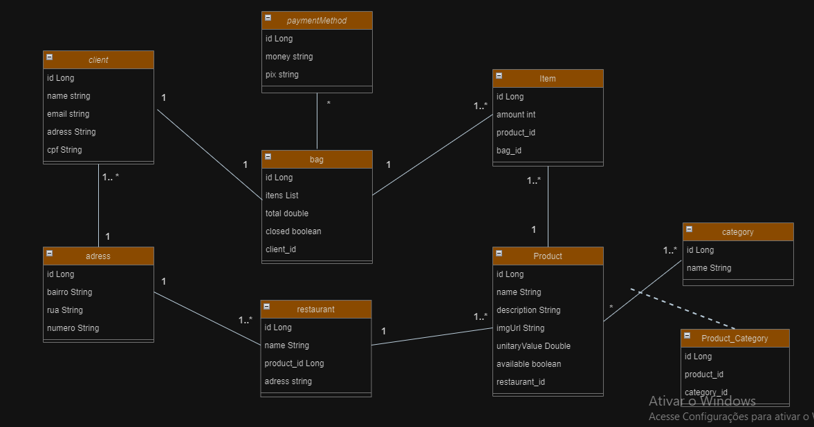

# apiFood

## Diagrama de Classes (Domínio da API)

## ✔️ Técnicas e tecnologias utilizadas

- ``Java 17``
- ``InteliJ IDEA``
- ``Paradigma de orientação a objetos``
- ``Spring Boot``
- ``Spring Data JPA``
- ``Hibernate``
- ``RESTful APIs``
- ``PostgreSQL``
- ``Maven``
- ``DTO (Data Transfer Objects)``
- ``Swagger``
- ``Insomnia``

## ✔️ Funcionalidades Principais

- ``Autenticação e autorização com JWT``
- ``CRUD de entidades ()``
- ``Tratamento de exceções``
- ``Validação de dados``
- ``Paginação e ordenação de resultados``

